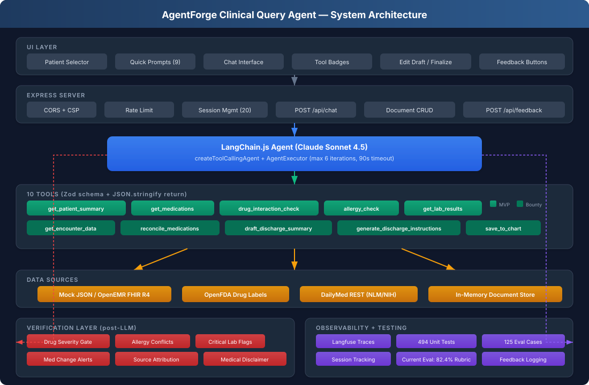

# Architecture

## System overview



The application is a TypeScript/Express service with a browser UI, a LangChain.js tool-calling agent, deterministic post-response verification, and selectable mock or OpenEMR FHIR data sources.

```text
Browser UI
  -> Express API
  -> LangChain.js AgentExecutor
  -> clinical tools
  -> mock data / OpenEMR FHIR / DailyMed
  -> deterministic verification
  -> response + safety alerts
```

## Agent

The runtime model is Claude Sonnet 4.5, configurable through `MODEL`. The agent uses `createToolCallingAgent` with native tool calls, a maximum of six iterations, and a 90-second request timeout.

Conversation history is session-scoped. Clinical data is retrieved by tools rather than inserted wholesale into the system prompt.

## Tools

| Tool | Responsibility |
|---|---|
| `get_patient_summary` | Demographics, conditions, allergies, and recent encounters |
| `get_medications` | Active medication list |
| `drug_interaction_check` | Interaction lookup |
| `allergy_check` | Medication/allergy conflict check |
| `get_lab_results` | Laboratory results |
| `get_encounter_data` | Admission and encounter details |
| `reconcile_medications` | Admission/discharge comparison |
| `draft_discharge_summary` | Structured clinician draft |
| `generate_discharge_instructions` | Patient instructions with drug education and appointments |
| `save_to_chart` | Draft, edit, retrieve, and finalize documents |

Tool inputs use Zod schemas and outputs are structured JSON.

## Data sources

- **Mock JSON:** default, deterministic demonstration data.
- **OpenEMR FHIR R4:** OAuth2-backed patient, medication, observation, allergy, encounter, and appointment retrieval.
- **DailyMed:** medication labeling and patient education.
- **OpenFDA:** fallback interaction information.
- **Document store:** demo-grade local/in-memory persistence, not a production clinical record store.

FHIR and DailyMed responses use bounded caches to reduce repeated calls.

## Verification

After the model returns, `applyVerification` inspects tool results and emits structured safety alerts for:

- serious or critical drug interactions;
- allergy conflicts;
- critical laboratory values;
- medication changes;
- missing source attribution; and
- missing medical disclaimers.

This layer is deterministic and adds no model call. It supplements the agent response; it is not a substitute for authentication, authorization, patient scoping, clinician review, or validated clinical decision support.

## Request and state flow

1. Express validates the request and applies rate limits.
2. Session history and patient context are loaded.
3. The agent selects and executes tools, up to six iterations.
4. The model synthesizes a response with sources.
5. Deterministic verification creates safety alerts.
6. The API returns the response, tools used, sources, alerts, and correlation metadata.
7. Draft documents remain editable until explicitly finalized.

## Observability

Langfuse callbacks capture agent traces when configured. Session identifiers correlate application activity; real trace identifiers are returned only when an active telemetry span is available.

Default local operation does not require Langfuse. Clinical deployments would require stricter controls over trace content and retention.

## Boundaries

The current implementation is a bounty/demo system:

- mock data is the safe default;
- FHIR access is read-oriented;
- document workflow is draft-first;
- clinician review remains mandatory;
- production identity, authorization, audit, encrypted persistence, and HIPAA controls are not implemented.

See [SECURITY.md](SECURITY.md) for the operational security posture and [evals.md](evals.md) for verification methodology.
