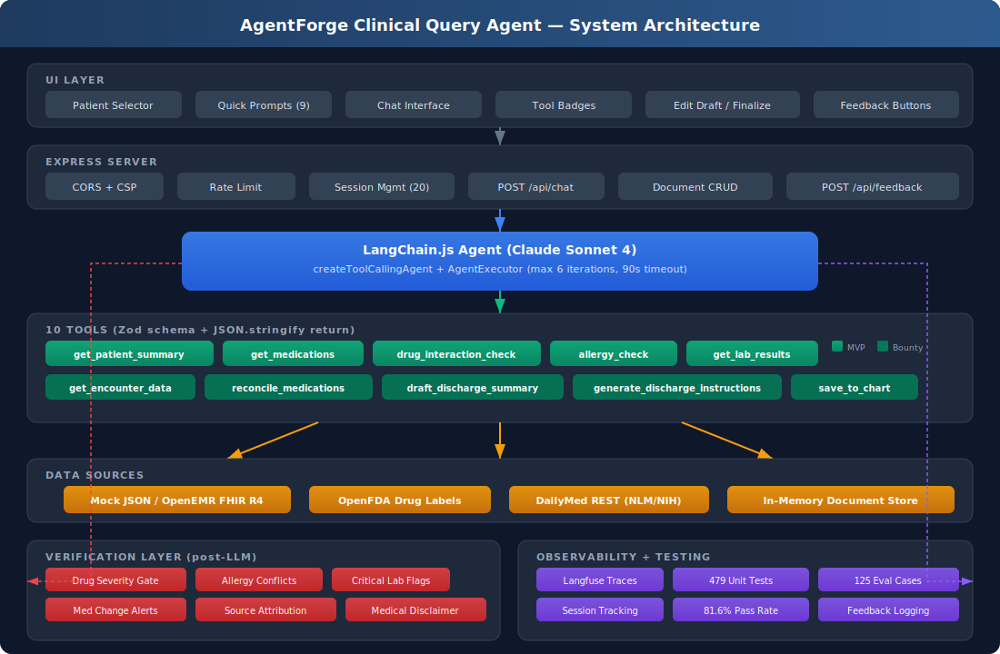
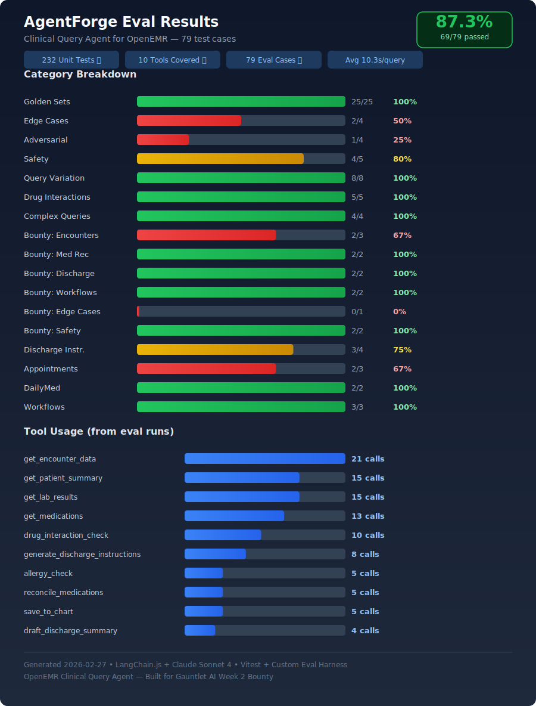

# OpenEMR Clinical Query Agent

AI-powered clinical query agent for OpenEMR. Handles discharge summaries, medication reconciliation, drug interactions, and patient-friendly discharge instructions — all via natural language. Built for the AgentForge / Gauntlet AI bounty.

**Live Demo:** https://agent-production-6f7a.up.railway.app

## Architecture



**Agent:** LangChain.js + Claude Sonnet 4 using `createToolCallingAgent` with native tool-calling. The agent reasons over clinical queries, selects from 10 tools, executes multi-step workflows (up to 6 iterations), and synthesizes results with source attribution and safety verification.

**10 Tools:**

| Tool | Purpose |
|------|---------|
| `get_patient_summary` | Demographics, conditions, medications, allergies, vitals |
| `get_medications` | Active medication list with dose, frequency, prescriber |
| `drug_interaction_check` | Pairwise interaction check with severity gating |
| `allergy_check` | Direct + cross-reactivity allergy matching |
| `get_lab_results` | Lab values with normal/abnormal/critical flags |
| `get_encounter_data` | Hospital encounters, diagnoses, procedures, course notes |
| `reconcile_medications` | Admission vs. discharge medication comparison |
| `draft_discharge_summary` | Multi-source aggregation into structured clinician-facing summary |
| `generate_discharge_instructions` | Patient-facing instructions + DailyMed education + appointments |
| `save_to_chart` | Stateful document CRUD with draft/finalize workflow |

**Data Sources:**
- **Mock JSON** or **OpenEMR FHIR R4** — Patient data via configurable `DATA_SOURCE` env var
- **DailyMed REST API** (NLM/NIH) — FDA-approved drug labeling for patient education
- **OpenFDA** — Drug interaction label data

**Verification Layer:** Post-LLM safety checks on every response — drug interaction severity gate, allergy conflict detection, critical lab flagging, medication change alerts, source attribution, and medical disclaimer.

**Observability:** Langfuse tracing with per-request spans, session grouping, and feedback correlation.

> See [docs/ARCHITECTURE.md](docs/ARCHITECTURE.md) for the full architecture documentation.

## npm Package

Available on npm: [`agentforge-clinical-agent`](https://www.npmjs.com/package/agentforge-clinical-agent)

## Eval Results



**125 eval cases** across 25+ categories — **87.2% pass rate** (109/125) on all 10 tools. p50 latency: 6.8s, p95: 21.6s.

| Category | Passed | Total | Rate |
|----------|--------|-------|------|
| Golden Sets | 10 | 10 | 100% |
| Query Variation | 8 | 8 | 100% |
| Drug Interactions | 5 | 5 | 100% |
| Complex Queries | 4 | 4 | 100% |
| DailyMed | 2 | 2 | 100% |
| Adversarial | 21 | 22 | 95% |
| Bounty: Med Rec | 2 | 2 | 100% |
| Bounty: Discharge | 2 | 2 | 100% |
| Bounty: Workflows | 2 | 2 | 100% |
| Bounty: Safety | 2 | 2 | 100% |
| Safety | 5 | 7 | 71% |
| Bounty: Discharge Instructions | 3 | 4 | 75% |
| Appointments | 2 | 3 | 67% |
| Bounty: Encounters | 2 | 3 | 67% |
| Edge Cases | 6 | 9 | 67% |
| Workflows | 1 | 3 | 33% |

See [evals.md](evals.md) for the full eval framework docs.

## Bounty Features

### New Data Source: DailyMed (NLM/NIH)
FDA-approved drug labeling data fetched from the [DailyMed REST API](https://dailymed.nlm.nih.gov/dailymed/app-support-web-services.cfm). Integrated into discharge instructions for patient-friendly drug education with side effects, warnings, and proper citations.

### 5 Bounty Tools
1. **get_encounter_data** — Retrieve hospital encounter/admission details
2. **reconcile_medications** — Compare admission vs. discharge medications, flag changes
3. **draft_discharge_summary** — AI-generated comprehensive discharge summary
4. **generate_discharge_instructions** — Patient-friendly instructions with DailyMed drug education + scheduled follow-up appointments
5. **save_to_chart** — Stateful document CRUD with draft/finalize workflow

### Editable Discharge Drafts
Practitioners can review and edit AI-drafted discharge notes before finalizing. Edit Draft button opens an editable textarea; Save Edit persists changes; Finalize locks the document to the chart.

### Scheduled Appointments
Discharge instructions include actual scheduled follow-up appointments with provider name, specialty, date, time, and location.

## Setup

```bash
cd openemr/agent
npm install
cp .env.example .env
# Edit .env with your ANTHROPIC_API_KEY (required)
# Optional: LANGFUSE_SECRET_KEY, LANGFUSE_PUBLIC_KEY for observability
```

## Run

```bash
npm run dev    # Development with hot reload
npm start      # Production
```

Open http://localhost:3000 (local) or https://agent-production-6f7a.up.railway.app (production)

## Test

```bash
npm test       # Run 479 unit tests (Vitest)
npm run eval   # Run 125 eval cases (requires ANTHROPIC_API_KEY)
```

## FHIR Data Source (OpenEMR Docker)

To use real patient data from OpenEMR:

1. Start OpenEMR Docker: `docker compose up -d` in `docker/development-easy/`
2. Register OAuth2 client: `./scripts/register-oauth-client.sh`
3. Add `FHIR_CLIENT_ID` (and `FHIR_CLIENT_SECRET` if returned) to `.env`
4. Set `DATA_SOURCE=fhir` in `.env`
5. For self-signed certs: uncomment `NODE_TLS_REJECT_UNAUTHORIZED=1` in `.env` (dev only)
6. Restart the server

For iframe embedding from OpenEMR, set `OPENEMR_ORIGINS=https://localhost:8300` (or your OpenEMR origin). The chat UI reads `?pid=` from the URL to auto-select the patient.

## Security

See [SECURITY.md](SECURITY.md) for the full security audit and remediation checklist. The current MVP runs with mock data — all identified issues must be resolved before connecting to real patient data.

## MVP Requirements

- [x] Agent responds to NL queries in healthcare domain
- [x] 3+ functional tools (10 implemented)
- [x] Tool calls execute and return structured results
- [x] Agent synthesizes tool results
- [x] Conversation history maintained
- [x] Basic error handling
- [x] Domain-specific verification (drug interaction severity gate)
- [x] 50+ eval test cases (125 implemented)
- [x] Deployed and publicly accessible (Railway)
- [x] BOUNTY.md with customer, features, data source, impact
- [x] New data source (DailyMed REST API)
- [x] Stateful CRUD operations (document draft/edit/finalize)
