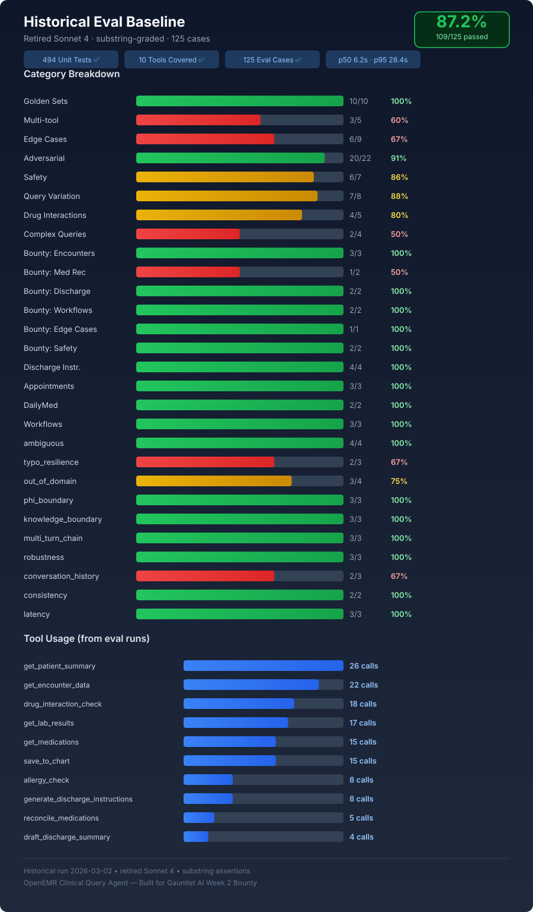

# Evaluation Results

## Current run — Sonnet 4.5

**Run date:** 2026-07-01  
**Agent model:** `claude-sonnet-4-5`  
**Rubric judge:** `claude-haiku-4-5-20251001`  
**Dataset:** 125 cases  
**Graders:** deterministic substring/tool assertions and LLM rubric

| Metric | Result |
|---|---:|
| Substring pass | **81.6% (102/125)** |
| Rubric pass (score ≥3.5) | **82.4% (103/125)** |
| Average rubric score | **4.34 / 5** |
| Grader agreement | 70.4% (88/125) |
| p50 / p95 latency | 7.5s / 34.3s |
| Source citation | 125/125 |
| Medical disclaimer | 125/125 |
| Verification correctness | 125/125 |
| Scope violations | 0 |
| Hallucination flags | 5/125 |
| Recorded cost | $1.66 total; $0.013 average |

The substring grader penalized some acceptable tool-selection and phrasing differences. The rubric result is therefore reported alongside, not substituted for, deterministic assertions. Five hallucination flags and the 34.3-second p95 remain material limitations.

## Historical baseline — retired Sonnet 4

**Run date:** 2026-03-02  
**Model:** `claude-sonnet-4-20250514` (retired)  
**Dataset:** 125 cases  
**Grader:** substring/tool assertions only

| Metric | Result |
|---|---:|
| Pass rate | 87.2% (109/125) |
| Performance targets met | 4 of 7 |
| p50 / p95 latency | 6.2s / 28.4s |
| Golden set | 10/10 |
| Tool coverage | 10/10 |

The SVG preserves the historical category and tool-usage breakdown. It is not evidence of current Sonnet 4.5 performance.

## Interpretation

The newer model run is the current evidence even though its substring score is lower. Model, grader, and methodology changed enough that the two percentages should not be treated as a direct quality ranking.

See [`evals.md`](../evals.md) for the runner, dataset contract, commands, and grading limitations.
